# Pdf

**Gemini Linux BSP Production**

**Installation Instructions**

Revision A.0 Jan2021

| **Revision** | **Date** | **Comment** |
| :--- | :--- | :--- |
| A.0 | 29/ Jan/2021 | Initial release |
|  |  |  |

 Copyright 2021

 _**FOR TECHNICAL SUPPORT**_ Diamond Systems Corporation

 _**PLEASE CONTACT:**_ [www.diamondsystems.com](http://www.diamondsystems.com/)

 [**support@diamondsystems.com**](mailto:support@diamondsystems.com)

**CONTENTS**

[1. Document Overview 3]()

[2. M.2 2242 installation instructions 3]()

## Document Overview

This document shows detailed steps for 8510893\_A\_BSP\_GEMINI\_LNX\_5.4\_64-BIT\_64GB image installation on M.2 2242 and copying the Linux BSP files to DVD.

## M.2 2242 installation instructions

**Files required**

* 8510893\_A\_BSP\_GEMINI\_LNX\_5.4\_64-BIT\_64GB.tib

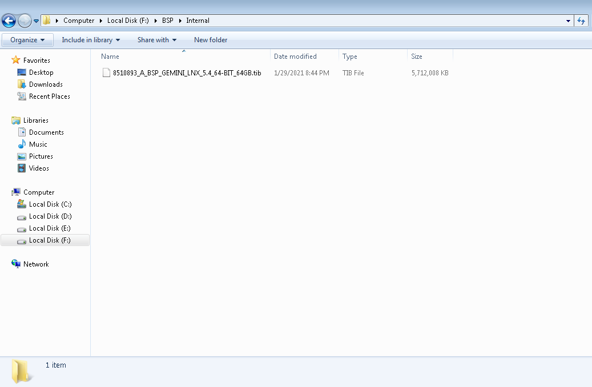

**Setup Requirements**

* Acronis True Image 2018.
* M.2 2242 of 64GB or Higher– Target media
* One 32 GB pen drives
* 32 GB pen drive – To have the Venus KBL BSP Image folder
* Open Acronis True Image 2018. \(Refer Figure 1\).

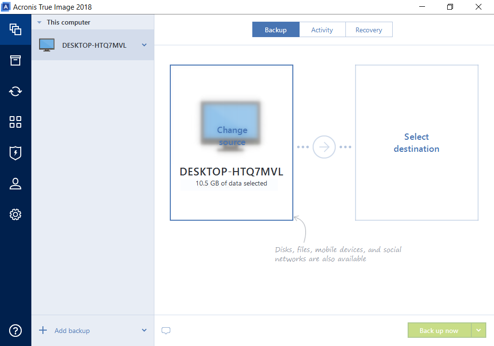

 Figure 1

* In Add backup, select **Add existing backup**. \(Refer Figure 2\)

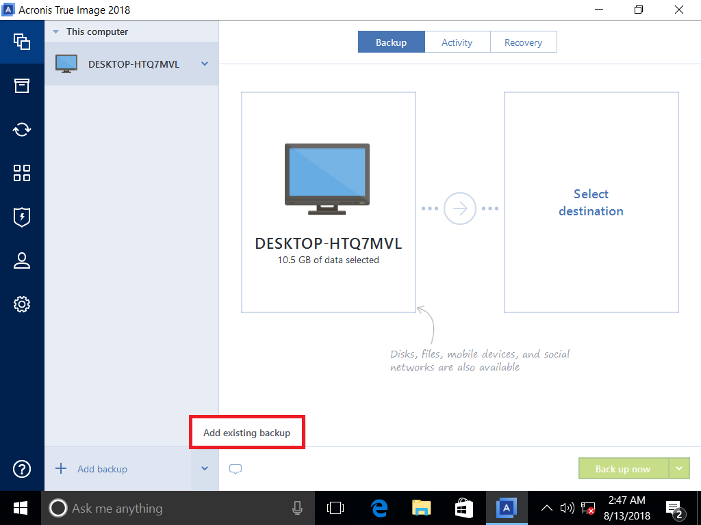

Figure 2

* Navigate to the path of 8510893\_A\_BSP\_GEMINI\_LNX\_5.4\_64-BIT\_64GB .tib file.

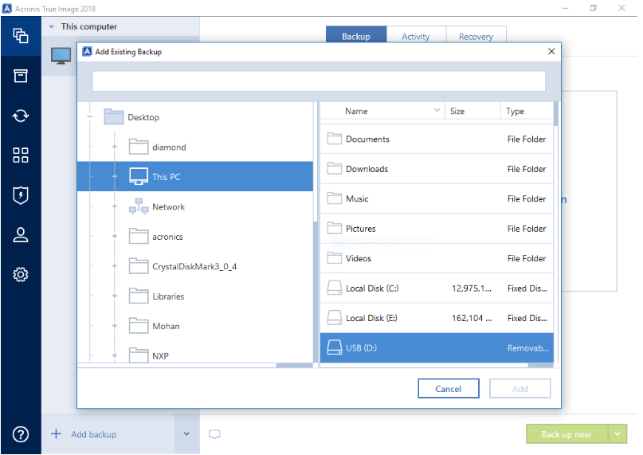

 Figure 3

* Select the 8510893\_A\_BSP\_GEMINI\_LNX\_5.4\_64-BIT\_64GB.tib file and click Add. \(Refer Figure 4\)

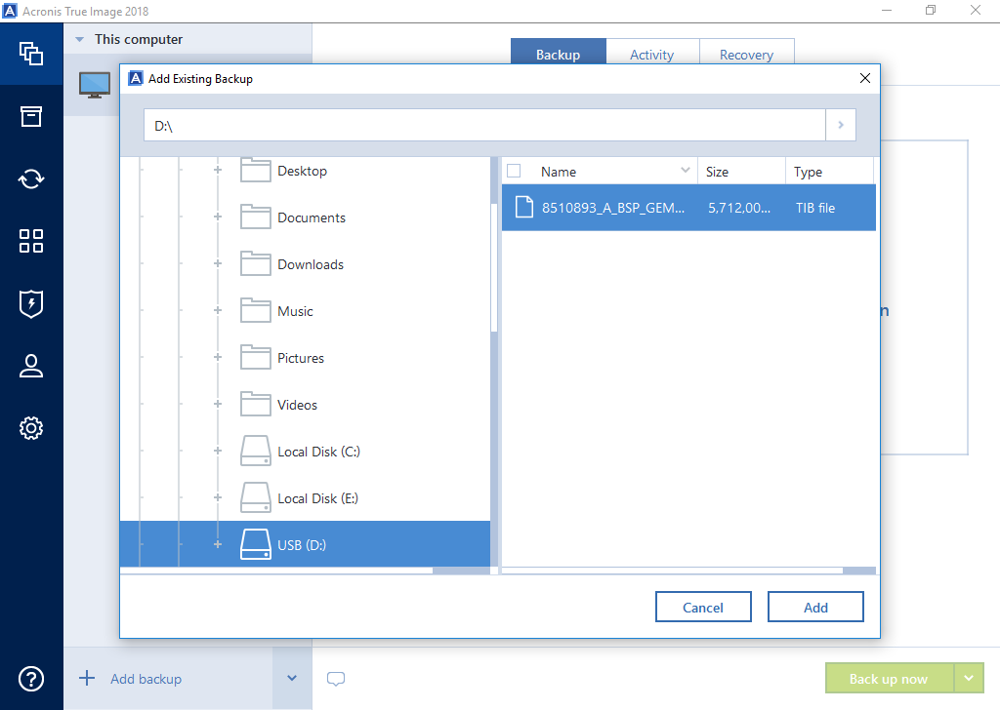

 Figure 4

* The 8510893\_A\_BSP\_GEMINI\_LNX\_5.4\_64-BIT\_64GB.tib file will be added in the source directory. \(Refer Figure 5\)

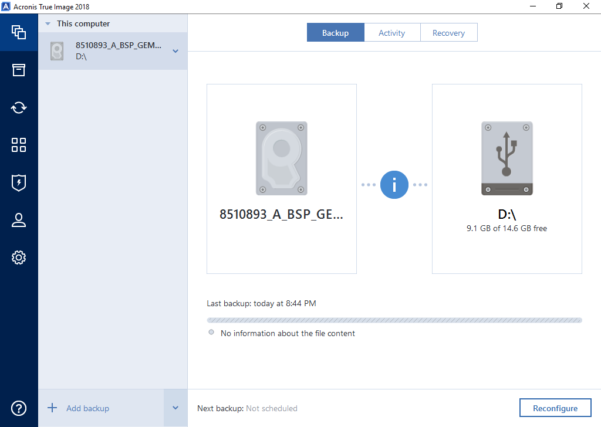

 **Figure 5**

* Move to Recovery section and select Recovery disk. \(Refer Figure 6\)

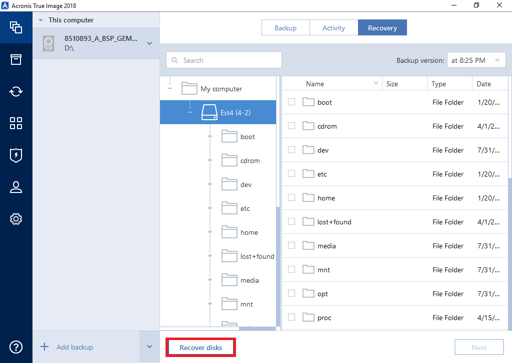

 Figure 6

* Check the M.2 2242 in Disks section. \(Refer Figure 7\). In select disk option, select the M.2 2242 & Select the Recovery now option.

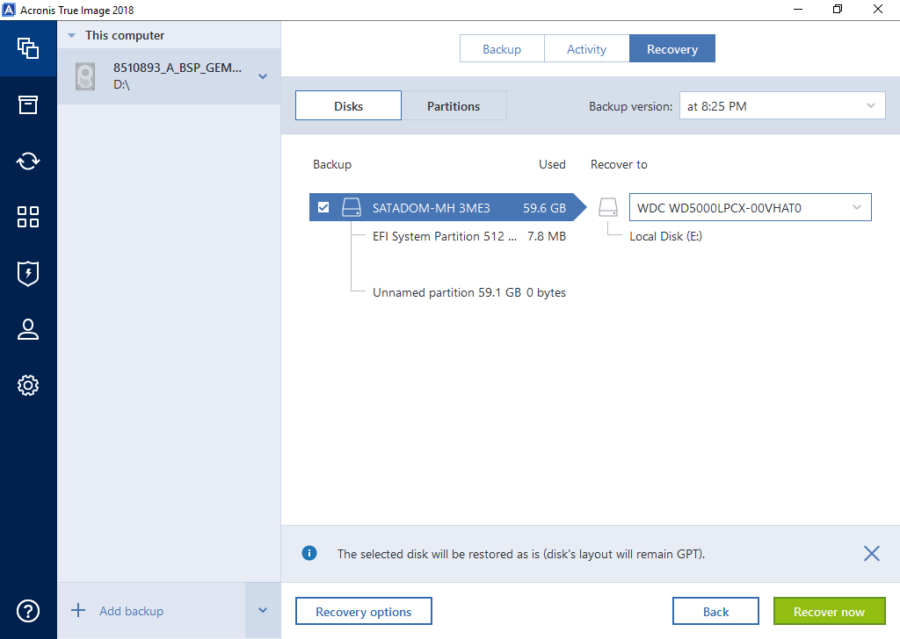

Figure 7

* Press ‘Yes’ to confirm the recover to M.2 2242. \(Refer Figure 9\)

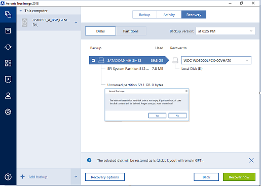

Figure 8

* The recovery will start and dump the image in M.2 2242. \(Refer Figure 10\)

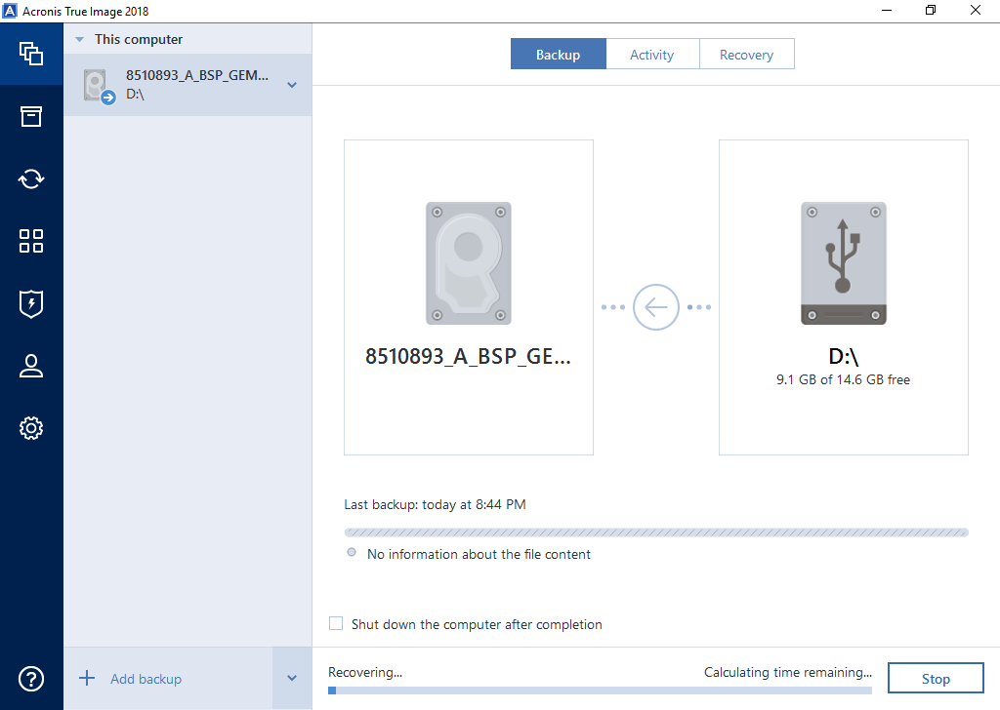

 Figure 9

* The Image is recovered successfully and now the M.2 2242 is ready to boot to Venus KBL Ubuntu 64bit OS.

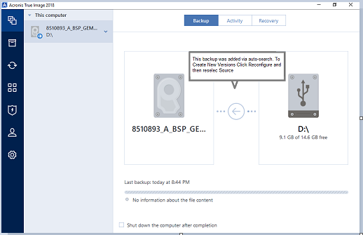

Figure 10

